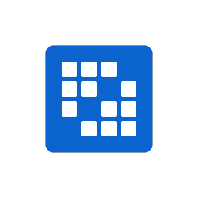

Hi there! 👋🏼

I’m Alexia, a **frontend**-focused **full stack developer** with interest in **accessibility** and **UI design**.

 

## Tools & Technologies

Tools and technologies I have used in my work/school/personal projects:

-   **Frontend**: HTML5, CSS3, JavaScript, TypeScript, React, SASS, Tailwind
-   **Backend**: Node.js, Django, Scala, PostgreSQL, MongoDB
-   **Other**: Git, SVN, Liferay
-   **Design**: Adobe XD, Illustrator, InDesign, Photoshop, Lightroom, Figma

 

 

### Currently learning:

-   Vue.js and GraphQL

 

